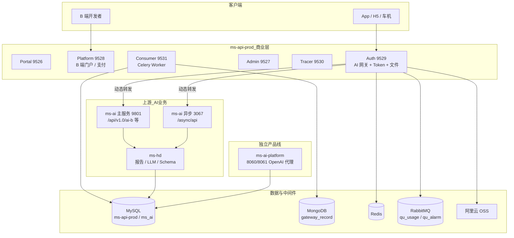
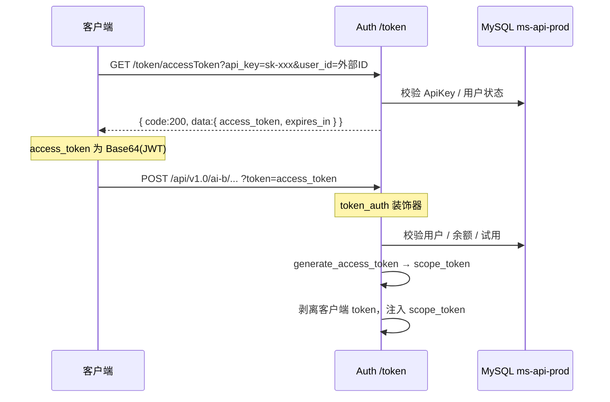
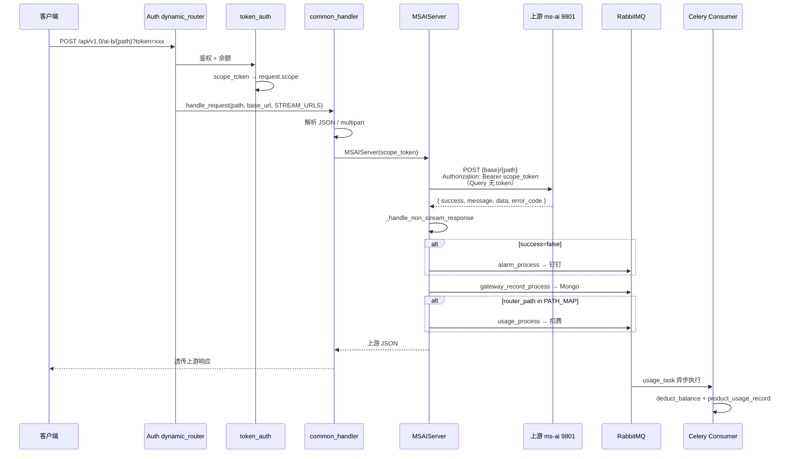
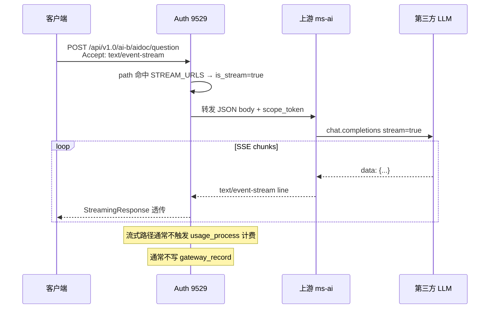
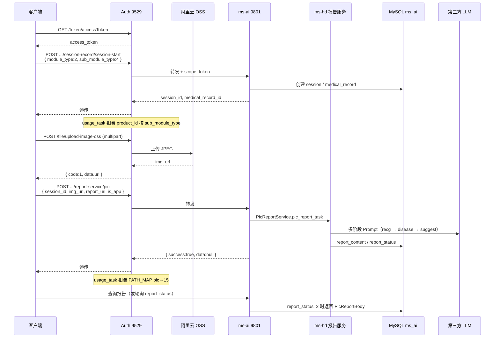
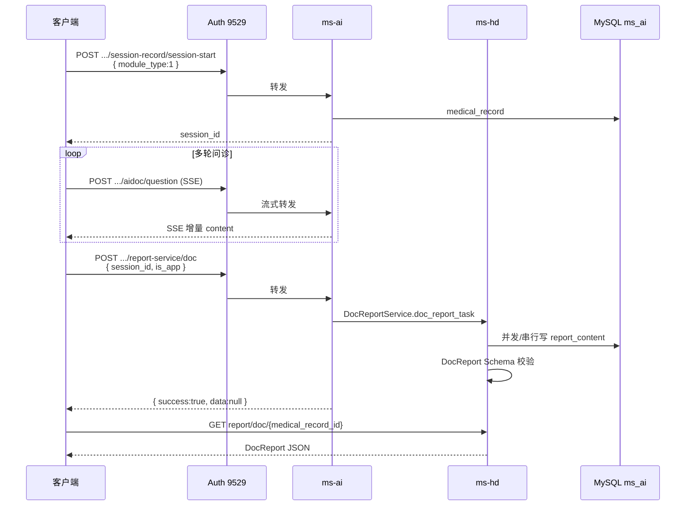
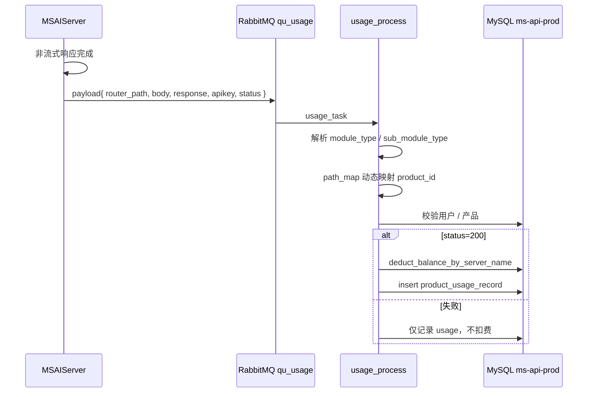
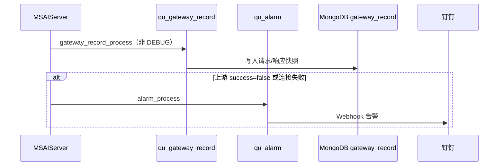
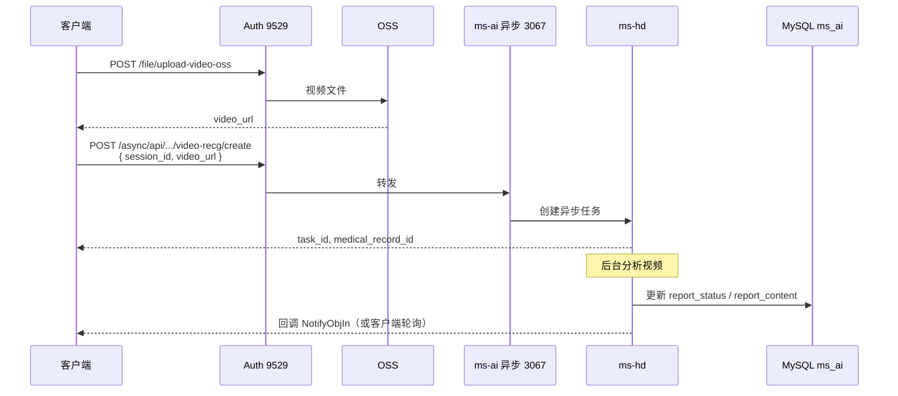

# 宠物 AI 开放平台 — 时序图与功能清单

> 文档版本：v1.0  
> 生成时间：2026-06-10  
> 适用范围：**ms-api-prod**（网关/开放平台）+ **ms-ai 上游**（9801/3067）+ **ms-hd**（报告/LLM）+ **ms-ai-platform**（OpenAI 聚合，独立产品线）  
> 数据来源：项目源码静态分析（`ms-api-prod`、`swl_back/ms-hd`、架构扫描报告）

---

## 相关文档

| 文档 | 路径 |
|------|------|
| 多媒体接口入参出参 | `docs/pet_ai_api_multimedia.md` |
| 全量 API 目录 | `API_PROD.md` |
| 模型-表结构对比 | `docs/ms-api-prod_model_diff.md` |
| MySQL 全库扫描 | `../ms-ai-platform-main-11ce29ed1ff7197e2ea626c21db381ed8149e6a5/tools/mysql_scan_report.md` |
| 平台架构分析 | `../ms-ai-platform-main-11ce29ed1ff7197e2ea626c21db381ed8149e6a5/tools/architecture_analysis_report.md` |

---

## 一、系统架构总览



---

## 二、服务与端口

### 2.1 ms-api-prod 进程

| 服务 | 启动命令 | 默认端口 | 职责 |
|------|----------|----------|------|
| Admin | `python main.py admin` | 9527 | 管理后台、产品/订单/用户 |
| Platform | `python main.py platform` | 9528 | B 端用户门户、支付 |
| **Auth** | `python main.py auth` | **9529** | **AI 网关、Token、文件上传** |
| Portal | `python main.py portal` | 9526 | 官网 API |
| Tracer | `python main.py tracer` | 9530 | 产品体验埋点 |
| Consumer | `python main.py consumer` | 9531 | Celery 消费（计费/日志/告警） |

### 2.2 上游 AI 服务（由环境变量配置）

| 实例 | 典型端口 | 环境变量 | 路径前缀 |
|------|----------|----------|----------|
| ms-ai 主服务 | **9801** | `MS_AI_SERVER_BASE_URL` | `/api/v1.0/ai-b` |
| ms-ai V2 | 9801 | `MS_AI_V2_SERVER_BASE_URL` | `/api/v2.0/ai-b` |
| ms-ai 英文 | 9801 | `MS_EN_AI_SERVER_BASE_URL` | `/api/v1.0/ai-en` |
| ms-ai 异步 | **3067** | `MS_AI_ASYNC_SERVER_BASE_URL` | `/async/api` |
| ms-ai 韩文 | 9801 | `MS_AI_KOREAN_SERVER_BASE_URL` | `/api/v1.0/ai-korean` |

### 2.3 ms-hd（报告域，内嵌或独立部署）

| 配置 | 说明 |
|------|------|
| `APPLICATION_PORT` | `.env` 配置，无固定默认值 |
| `root_path` | `/hd` |
| 数据库 | `ms_ai` + HD 库 |

### 2.4 ms-ai-platform（独立，非宠物问诊主链）

| 服务 | 默认端口 |
|------|----------|
| 用户端 OpenAI 代理 | 8060 |
| 管理端 | 8061 |

---

## 三、功能点总览

### 3.1 Auth 网关（9529）— 对外 AI 入口

| 编号 | 功能模块 | 路径/方式 | 实现方式 | 计费 |
|------|----------|-----------|----------|------|
| A1 | 获取 access_token | `GET /token/accessToken` | 网关原生 | 否 |
| A2 | 获取 scope token | `POST /token/gettoken` | 网关原生 | 可选 |
| A3 | Token 校验 | `POST /token/verify` | 网关原生 | 否 |
| A4 | **AI 动态转发** | `/api/v1.0/ai-b/{path}` 等 7 组 | 透明代理 → ms-ai | 见 PATH_MAP |
| A5 | 图片上传 OSS | `POST /file/upload-image-oss` | 网关原生 | 否 |
| A6 | 视频上传 OSS | `POST /file/upload-video-oss` | 网关原生 | 否 |
| A7 | OSS 直传签名 | `POST /file/upload-policy` | 网关原生 | 否 |
| A8 | 大文件分片 upload_id | `POST /file/get-resumable-upload-id` | 网关原生 | 否 |
| A9 | API Key 认证 | `/keys/*` | 网关原生 | — |

### 3.2 动态转发 — 上游 path 功能清单

#### 会话与问诊（文本）

| 编号 | 功能 | 上游 path | 传输 | 流式 | 计费 |
|------|------|-----------|------|------|------|
| B1 | 开启会话 | `session-record/session-start` | JSON | 否 | 是 (product_id=1，可 override) |
| B2 | 文本问诊 | `aidoc/question` | SSE | **是** | **否**（流式不计费） |
| B3 | 问诊摘要 | `aidoc/summary` | SSE | 是 | 否 |
| B4 | 推理信息 | `aidoc/reason-info` | SSE | 是 | 否 |
| B5 | 是否继续追问 | `aidoc/if-continue-ask` | SSE | 是 | 否 |
| B6 | 异宠追问 | `aidoc-exotic/if-continue-ask` | SSE | 是 | 否 |
| B7 | 通用对话 | `ai-conv/answer` | SSE | 是 | 否 |
| B8 | 文本问诊报告 | `report-service/doc` | JSON | 否 | 视配置 |
| B9 | 问诊异步报告 | `aidoc/report-task` | JSON | 否 | scope 授权 |

#### 图片识别与报告

| 编号 | 功能 | 上游 path | sub_module_type | 传输 | 计费 |
|------|------|-----------|-----------------|------|------|
| C1 | 图片报告（通用） | `report-service/pic` | 1~8 | JSON | 是 (15，可 override) |
| C2 | 品种识别 | 同上 | 1 | JSON | 是 |
| C3 | 情绪识别 | 同上 | 2 | JSON | 是 |
| C4 | 牙齿 | 同上 | 3 | JSON | 是 |
| C5 | **粪便/排便物** | 同上 | **4** | JSON | 是 |
| C6 | 呕吐物 | 同上 | 5 | JSON | 是 |
| C7 | 皮肤 | 同上 | 6 | JSON | 是 |
| C8 | 耳朵 | 同上 | 7 | JSON | 是 |
| C9 | 眼睛 | 同上 | 8 | JSON | 是 |
| C10 | 图片流式摘要 | `aipic/summary` | — | SSE | 否 |
| C11 | 异宠图片摘要 | `aipic-exotic/summary` | — | SSE | 否 |
| C12 | 图片异步任务 | `aipic/report-task` | — | JSON | scope 授权 |
| C13 | 异宠图片报告 | `report-service/pic_exotic` | — | JSON | 视配置 |
| C14 | 体检报告 | `report-service/checkup` | — | JSON | 视配置 |

#### 视觉 / 语音 / 其他识别

| 编号 | 功能 | 上游 path | product_id |
|------|------|-----------|------------|
| D1 | 余粮识别 | `recognition/surplus_grain` | 11 |
| D2 | 相似识别 | `recognition/similar` | 12 |
| D3 | 进食识别 | `recognition/eating` | 13 |
| D4 | 多宠识别 | `recognition/mul_pet` | 14 |
| D5 | 鸟种识别 v3 | `recognition/identifying_birds_v3` | 56 |
| D6 | 语音分析 | `ai-voice/analysis` | 80 |

#### 视频 / RTC（Schema 在 ms-hd，上游 path 因环境而异）

| 编号 | 功能 | 说明 |
|------|------|------|
| E1 | 视频上传 | 走 Auth `/file/upload-video-oss` |
| E2 | 视频行为分析 | 异步 task + 回调，非 SSE |
| E3 | 实时音视频 RTC | 火山引擎 WebRTC Token，非 HTTP 代理 |

### 3.3 ms-hd 报告服务（下游能力）

| 编号 | 功能 | 内部 API（建议/代码） | 核心类 |
|------|------|----------------------|--------|
| H1 | 图片报告 | `POST .../report/pic` | `PicReportService` |
| H2 | 文本报告 | `POST .../report/doc` | `DocReportService` |
| H3 | 体检报告 | `POST .../report/checkup` | `CheckupReportService` |
| H4 | 异宠图片报告 | `POST .../report/pic_exotic` | `PicExoticReportService` |
| H5 | 获取文本报告 | `GET .../report/doc/{id}` | `DocReportService` |
| H6 | LLM 调用 | — | `LlmRequest` |
| H7 | Prompt 配置 | Redis + DB | `GptHelper` |
| H8 | 报告 Schema 校验 | — | `ReportService.report_schema_validate` |
| H9 | 设备绑定/定位 | `/device-*` | 独立 HD 域 |

> 注：备份代码中 `report_service` 路由未挂载到 `api.py`，生产可能由 ms-ai 主服务内嵌或独立进程暴露。

### 3.4 Platform / Admin（9528 / 9527）— 商业能力

| 编号 | 功能 | 说明 |
|------|------|------|
| P1 | 用户注册/登录 | Platform `/auth/*` |
| P2 | API Key 管理 | Platform `/apikey/*` |
| P3 | 产品/套餐/订单 | Platform + Admin |
| P4 | 余额/扣费 | `UserDal.deduct_balance_by_server_name` |
| P5 | 用量记录 | `product_usage_record` |
| P6 | 试用额度 | `ProductTrialDal` |
| P7 | 支付（微信/支付宝） | Payment 服务 |
| P8 | 管理后台 RBAC | Admin `/admin/*` |

### 3.5 ms-ai-platform（独立）

| 编号 | 功能 | 路径 |
|------|------|------|
| AP1 | OpenAI 兼容 Chat | `POST /chat/completions` |
| AP2 | 端点池管理 | Admin API |
| AP3 | 轮询/竞速调度 | `strategy: round_robin / race` |
| AP4 | 请求日志 | `request_logs.jsonl` |
| AP5 | 多模态 | text / image_url / video_url |

---

## 四、核心时序图

### 4.1 鉴权与 Token 换取



### 4.2 AI 动态转发（非流式 JSON 通用流程）



### 4.3 流式问诊（SSE）



### 4.4 粪便图片识别完整链路



### 4.5 文本问诊 + 文本报告



### 4.6 计费异步流程



### 4.7 网关日志与告警



### 4.8 视频行为分析（异步，非转发 SSE）



---

## 五、STREAM_URLS 与 PATH_MAP 配置

### 5.1 流式路径（STREAM_URLS）

命中则 `StreamingResponse` + `text/event-stream`，**通常不计费**：

```
aidoc/question
aidoc/summary
aidoc/reason-info
aidoc/if-continue-ask
aidoc-exotic/if-continue-ask
aipic/summary
aipic-exotic/summary
ai-conv/answer
```

### 5.2 计费路径（PATH_MAP）

| router_path | product_id | 备注 |
|-------------|------------|------|
| `session-record/session-start` | 1 | 可被 body.module_type / sub_module_type 覆盖 |
| `recognition/surplus_grain` | 11 | |
| `recognition/similar` | 12 | |
| `recognition/eating` | 13 | |
| `recognition/mul_pet` | 14 | |
| `recognition/identifying_birds_v3` | 56 | |
| `report-service/pic` | 15 | 可被 sub_module_type 覆盖 |
| `ai-voice/analysis` | 80 | |

---

## 六、响应格式对照

| 场景 | 格式 | 示例字段 |
|------|------|----------|
| 网关 SuccessResponse | `{ code, message, data }` | Token、部分 Platform API |
| 上游 ms_ai | `{ success, message, data, error_code }` | 动态转发透传 |
| 图片上传成功 | `{ code:1, data, msg, time }` | `/file/upload-image-oss` |
| SSE | `data: {...}\n\n` | 无 JSON envelope |

---

## 七、数据表与存储（关键）

| 存储 | 库/集合 | 用途 |
|------|---------|------|
| MySQL | `ms-api-prod.*` | 用户、订单、产品、API Key、`product_usage_record` |
| MySQL | `ms_ai.*` | `session_record`、`medical_record`、`report_content`、`gpt_config` |
| MongoDB | `gateway_record` | 网关请求/响应快照 |
| Redis | — | 限流、`path_map` 缓存、GPT connection_pool |
| RabbitMQ | `qu_usage` / `qu_alarm` / `qu_gateway_record` | 异步计费、告警、日志 |
| OSS | `ms-ai-b/` | 图片/视频 |

### medical_record.report_status

| 值 | 含义 |
|----|------|
| 0 | 未生成 |
| 1 | 生成中 |
| 2 | 已完成 |
| 3 | 格式校验失败 |
| 4 | 参数不合格（如图片不符合） |

---

## 八、日志路径

| 服务 | 路径 |
|------|------|
| ms-api-prod Auth | `{项目根}/logs/info_YYYY-MM-DD.log` |
| ms-hd | `{LOG_PATH}/{APPLICATION_NAME}-log` |
| ms-hd 报告 logger | `async-service` / `ai-log`（需确认 LOG_CONFIG 是否挂载） |
| ms-ai-platform | `./logs/`、`request_logs.jsonl` |

---

## 九、转发模式下的职责边界（速查）

| 能力 | 网关 Auth | 上游 ms-ai | ms-hd |
|------|-----------|------------|-------|
| 平台 Token 校验 | ✅ | ❌ | ❌ |
| scope_token 签发 | ✅ | ❌ | ❌ |
| 余额/试用校验 | ✅ | ❌ | ❌ |
| 请求转发 | ✅ | ❌ | ❌ |
| SSE 透传 | ✅ | 产生流 | ❌ |
| 计费 PATH_MAP | ✅ 触发 | ❌ | ❌ |
| gateway_record | ✅ 触发 | ❌ | ❌ |
| 会话/问诊业务 | ❌ | ✅ | 部分 |
| LLM / Prompt | ❌ | ✅ | ✅ |
| 报告生成/校验 | ❌ | 编排 | ✅ |
| 写 report_content | ❌ | 可能 | ✅ |
| 文件上传 OSS | ✅ 原生 | ❌ | ❌ |

---

## 十、已知限制与待确认项

1. **ms_ai 主服务** 完整路由未全部在 `swl_back` 备份中，部分 path 来自配置与 Schema 推断。  
2. **ms-hd** `report_service` 在备份 `api.py` 中未挂载，生产部署方式需对照线上。  
3. **SSE 接口不计费**，与 JSON 接口策略不一致。  
4. **流式请求** 通常不写 `gateway_record`，排查问诊问题需看上游日志。  
5. **ms-ai-platform** 与宠物问诊 ms-ai **为两套 API**，勿混用 base_url。  
6. 生产环境 **Nginx/Lua** 可替代部分 Python 网关逻辑（见 `gateway/api_handler.lua` → 9801）。

---

## 十一、Gin 改造参考（附录）

若用 Gin 替代 Auth 或 ms-ai 上游，需复刻：

1. `token_auth` → scope_token 换发  
2. `STREAM_URLS` 前缀匹配 → SSE 透传  
3. `PATH_MAP` + `usage_task` 异步计费  
4. `gateway_record` + `alarm_process`  
5. 非流式透传 `{ success, message, data, error_code }`  
6. 报告类接口 → 远程调用 ms-hd internal API  

详见此前架构讨论与 `docs/pet_ai_api_multimedia.md`。
